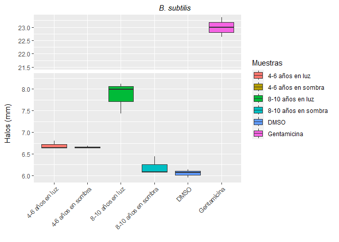
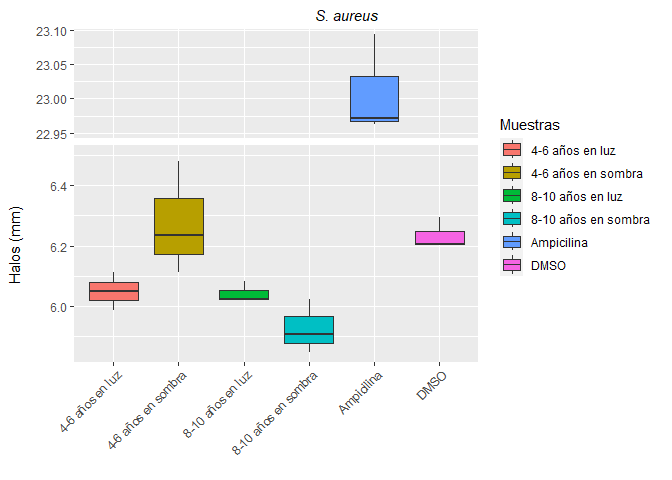
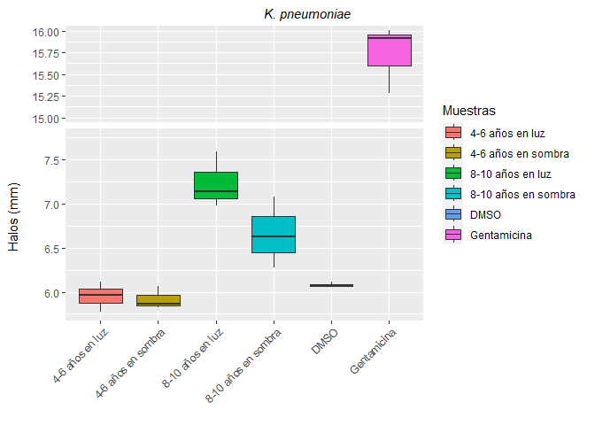
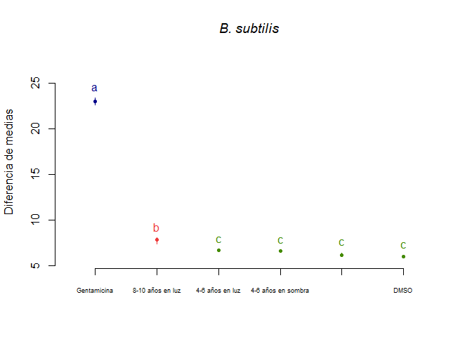
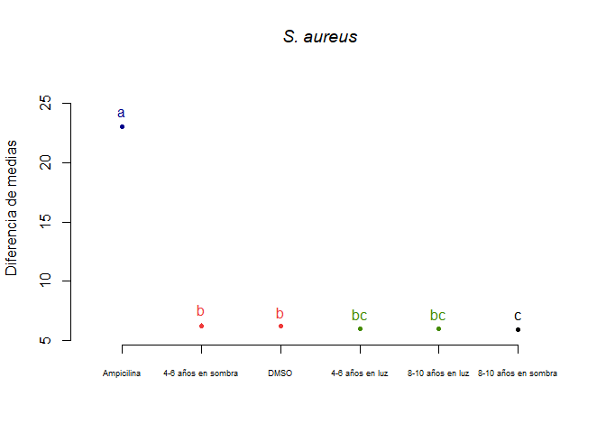
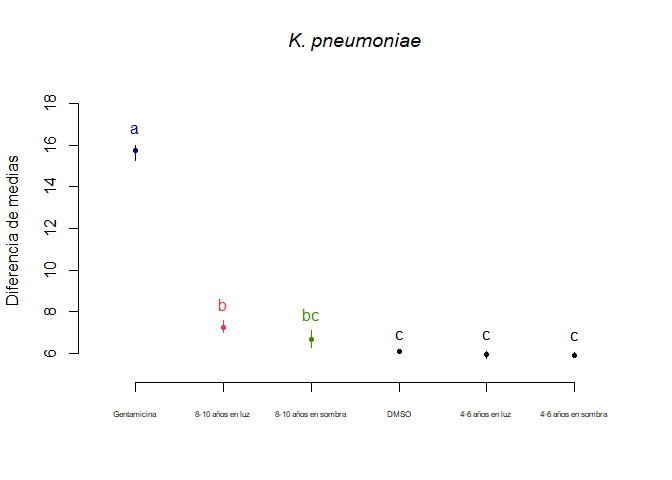

Actividad antimicrobiana de extracto hidroalcohólico de hojas de *I.
guayusa*
================
2023-09-01

- <a href="#objetivo-general" id="toc-objetivo-general">Objetivo
  general</a>
- <a href="#procesamiento-de-datos"
  id="toc-procesamiento-de-datos">Procesamiento de datos</a>
  - <a href="#cargado-de-datos" id="toc-cargado-de-datos">Cargado de
    datos</a>
  - <a href="#boxplot" id="toc-boxplot">Boxplot</a>
  - <a href="#homogeneidad-de-varianza"
    id="toc-homogeneidad-de-varianza">Homogeneidad de varianza</a>
  - <a href="#anova" id="toc-anova">ANOVA</a>
  - <a href="#prueba-de-tukey" id="toc-prueba-de-tukey">Prueba de tukey</a>

# Objetivo general

El presente trabajo tiene el objetivo de evaluar la actividad
antimicrobiana de extractos hidroalcohólicos de hojas de *I. guayusa* a
dos edades de la planta (especímenes de 4-6 años y 8-10 años) y dos
exposiciones de luz solar por cada edad (entorno de 65-190 lux y 200-425
lux).

# Procesamiento de datos

Los datos fueron obtenidos con el software
[ImageJ](https://imagej.nih.gov/ij/index.html) 1.53k v (Wayne Rasband,
National Institutes of Health, Maryland, USA) y ordenados en Excel
versión 2108.

## Cargado de datos

Las librerías R usadas se enlistan a continuación:

``` r
# Cargado de la biblioteca ggplot2
library(ggplot2)

# Instalación y cargado de la biblioteca agricolae
#install.packages("agricolae", repos = "https://cran.r-project.org")
library(agricolae)

# Instalación y cargado de la biblioteca ggbreak
#remotes::install_github("YuLab-SMU/ggbreak")
library(ggbreak)
```

Establecimiento del directorio de trabajo.

``` r
ppath <- "C:/Users/F4ss0/Documents/Ikiam21062022/Proyecto Guayusa/Antimicrobial_I_guayusa/"
```

Se cargó los datos almcenados en formato Excel para convertilos en
objetos R (DataFrame). Para ello se usó una variable por cada
microorganismo.

``` r
# Para B. subtilis
B_subtilis <- data.frame(readxl::read_excel("Data/Antimicrobial_H2O_Chakra_B.xlsx", 3))

# Para S. aureus
S_aureus <- data.frame(readxl::read_excel("Data/Antimicrobial_H2O_Chakra_B.xlsx", 4))

# Para K. pneumoniae
K_pneumoniae <- data.frame(readxl::read_excel("Data/Antimicrobial_H2O_Chakra_B.xlsx", 5))
```

## Boxplot

A continuación se extraen los diferentes factores para ANOVA
multifactorial por cada microorganismo.

``` r
# Para B. subtilis
dmso_bs <- B_subtilis[c(1:3),1]
gtm_bs  <- B_subtilis[c(1:3),2]
neg0_bs <- B_subtilis[c(1:3),3]
pos0_bs <- B_subtilis[c(1:3),4]
neg2_bs <- B_subtilis[c(1:3),5]
pos2_bs <- B_subtilis[c(1:3),6]

# Para S. aureus
dmso_sa <- S_aureus[c(1:3),1]
amp_sa  <- S_aureus[c(1:3),2]
neg0_sa <- S_aureus[c(1:3),3]
pos0_sa <- S_aureus[c(1:3),4]
neg2_sa <- S_aureus[c(1:3),5]
pos2_sa <- S_aureus[c(1:3),6]

# Para K. pneumoniae
dmso_kp <- K_pneumoniae[c(1:3),1]
gtm_kp  <- K_pneumoniae[c(1:3),2]
neg0_kp <- K_pneumoniae[c(1:3),3]
pos0_kp <- K_pneumoniae[c(1:3),4]
neg2_kp <- K_pneumoniae[c(1:3),5]
pos2_kp <- K_pneumoniae[c(1:3),6]
```

Determinación del número de réplicas (mínimo 3 réplicas).

``` r
n_sample  <- length(neg0_bs)
```

Extracción de datos para los boxplot.

``` r
# Para B. subtilis
halo_bs <- c(dmso_bs,
             gtm_bs,
             neg0_bs,
             pos0_bs,
             neg2_bs,
             pos2_bs)
extract_bs <- c(rep("DMSO",n_sample),
                rep("Gentamicina",n_sample),
                rep("4-6 años en sombra",n_sample),
                rep("4-6 años en luz",n_sample),
                rep("8-10 años en sombra",n_sample),
                rep("8-10 años en luz",n_sample))
datos_bs <- data.frame(extract_bs,halo_bs)

# Para S. aureus
halo_sa <- c(dmso_sa,
             amp_sa,
             neg0_sa,
             pos0_sa,
             neg2_sa,
             pos2_sa)
extract_sa <- c(rep("DMSO",n_sample),
                rep("Ampicilina",n_sample),
                rep("4-6 años en sombra",n_sample),
                rep("4-6 años en luz",n_sample),
                rep("8-10 años en sombra",n_sample),
                rep("8-10 años en luz",n_sample))
datos_sa <- data.frame(extract_sa,halo_sa)

# Para K. pneumoniae
halo_kp <- c(dmso_kp,
             gtm_kp,
             neg0_kp,
             pos0_kp,
             neg2_kp,
             pos2_kp)
extract_kp <- c(rep("DMSO",n_sample),
                rep("Gentamicina",n_sample),
                rep("4-6 años en sombra",n_sample),
                rep("4-6 años en luz",n_sample),
                rep("8-10 años en sombra",n_sample),
                rep("8-10 años en luz",n_sample))
datos_kp <- data.frame(extract_kp,halo_kp)
```

Graficación de boxplot.

``` r
# Para B. subtilis
bx_bs <- ggplot(datos_bs,aes(x=extract_bs,y=halo_bs,fill=extract_bs)) +
  geom_boxplot() +
  scale_y_break(c(8.25, 21.5), scales = 0.5) +
  ggtitle("B. subtilis") +
  guides(x=guide_axis(title = NULL), y=guide_axis(title = NULL), fill=guide_legend(title="Muestras")) +
  xlab(NULL) + ylab(guide_axis(title = "Halos (mm)")) +
  theme(plot.title = element_text(face="italic"), axis.text.x=element_text(angle=45, hjust=1))

# Para S. aureus
bx_sa <- ggplot(datos_sa,aes(x=extract_sa,y=halo_sa,fill=extract_sa)) +
  geom_boxplot() +
  scale_y_break(c(6.5, 22.95), scales = 0.5) +
  ggtitle("S. aureus") +
  guides(x=guide_axis(title = NULL), y=guide_axis(title = NULL), fill=guide_legend(title="Muestras")) +
  xlab(NULL) + ylab(guide_axis(title = "Halos (mm)")) +
  theme(plot.title = element_text(face="italic"), axis.text.x=element_text(angle=45, hjust=1))

# Para K. pneumoniae
bx_kp <- ggplot(datos_kp,aes(x=extract_kp,y=halo_kp,fill=extract_kp)) +
  geom_boxplot() +
  scale_y_break(c(7.75, 15), scales = 0.5) +
  ggtitle("K. pneumoniae") +
  guides(x=guide_axis(title = NULL), y=guide_axis(title = NULL), fill=guide_legend(title="Muestras")) +
  xlab(NULL) + ylab(guide_axis(title = "Halos (mm)")) +
  theme(plot.title = element_text(face="italic"), axis.text.x=element_text(angle=45, hjust=1))

bx_bs
```

<!-- -->

``` r
bx_sa
```

<!-- -->

``` r
bx_kp
```

<!-- -->

## Homogeneidad de varianza

Verificación de la homogeneidad de las variancias par ANOVA.

``` r
# Prueba para homogenidad de varianzas para B. subtilis
bartlett.test(halo_bs~extract_bs,data = datos_bs)
```

    ## 
    ##  Bartlett test of homogeneity of variances
    ## 
    ## data:  halo_bs by extract_bs
    ## Bartlett's K-squared = 9.9247, df = 5, p-value = 0.0774

Como el p-value es 0.0774, y éste es un valor superior de 0.05,
aceptamos la hipótesis nula (H0). Esto nos indica que las muestras
presentan varianzas semejantes.

``` r
# Prueba para homogenidad de varianzas para S. aureus
bartlett.test(halo_sa~extract_sa,data = datos_sa)
```

    ## 
    ##  Bartlett test of homogeneity of variances
    ## 
    ## data:  halo_sa by extract_sa
    ## Bartlett's K-squared = 6.0405, df = 5, p-value = 0.3023

Como el p-value es 0.3023, y éste es un valor superior de 0.05,
aceptamos la hipótesis nula (H0). Esto nos indica que las muestras
presentan varianzas semejantes.

``` r
# Prueba para homogenidad de varianzas para K. pneumoniae
bartlett.test(halo_kp~extract_kp,data = datos_kp)
```

    ## 
    ##  Bartlett test of homogeneity of variances
    ## 
    ## data:  halo_kp by extract_kp
    ## Bartlett's K-squared = 9.0677, df = 5, p-value = 0.1064

Como el p-value es 0.1064, y éste es un valor superior de 0.05,
aceptamos la hipótesis nula (H0). Esto nos indica que las muestras
presentan varianzas semejantes.

## ANOVA

Modelo de regresión para ANOVA para aquellos microorganismos que
mostraron homocedasticidad de varianza.

``` r
# Regresión Logit para B. subtilis (No aplica)
mylogit_bs <- glm(halo_bs~extract_bs,data = datos_bs)

# Regresión Logit para S. aureus
mylogit_sa <- glm(halo_sa~extract_sa,data = datos_sa)

# Regresión Logit para K. pneumoniae
mylogit_kp <- glm(halo_kp~extract_kp,data = datos_kp)
```

Se procede a realizar el test de ANOVA.

``` r
# Regresión Logit para B. subtilis (No aplica)
anova(mylogit_bs,test="LRT")
```

    ## Analysis of Deviance Table
    ## 
    ## Model: gaussian, link: identity
    ## 
    ## Response: halo_bs
    ## 
    ## Terms added sequentially (first to last)
    ## 
    ## 
    ##            Df Deviance Resid. Df Resid. Dev  Pr(>Chi)    
    ## NULL                          17     671.46              
    ## extract_bs  5   670.79        12       0.68 < 2.2e-16 ***
    ## ---
    ## Signif. codes:  0 '***' 0.001 '**' 0.01 '*' 0.05 '.' 0.1 ' ' 1

``` r
# Regresión Logit para S. aureus
anova(mylogit_sa,test="LRT")
```

    ## Analysis of Deviance Table
    ## 
    ## Model: gaussian, link: identity
    ## 
    ## Response: halo_sa
    ## 
    ## Terms added sequentially (first to last)
    ## 
    ## 
    ##            Df Deviance Resid. Df Resid. Dev  Pr(>Chi)    
    ## NULL                          17     714.72              
    ## extract_sa  5   714.61        12       0.11 < 2.2e-16 ***
    ## ---
    ## Signif. codes:  0 '***' 0.001 '**' 0.01 '*' 0.05 '.' 0.1 ' ' 1

``` r
# Regresión Logit para K. pneumoniae
anova(mylogit_kp,test="LRT")
```

    ## Analysis of Deviance Table
    ## 
    ## Model: gaussian, link: identity
    ## 
    ## Response: halo_kp
    ## 
    ## Terms added sequentially (first to last)
    ## 
    ## 
    ##            Df Deviance Resid. Df Resid. Dev  Pr(>Chi)    
    ## NULL                          17    223.992              
    ## extract_kp  5   223.06        12      0.934 < 2.2e-16 ***
    ## ---
    ## Signif. codes:  0 '***' 0.001 '**' 0.01 '*' 0.05 '.' 0.1 ' ' 1

## Prueba de tukey

``` r
# Para B. subtilis (No aplica)
modelo_bs <- aov(halo_bs~extract_bs,data = datos_bs)
tukey_bs <- HSD.test(modelo_bs,"extract_bs", group=TRUE,console=TRUE)
```

    ## 
    ## Study: modelo_bs ~ "extract_bs"
    ## 
    ## HSD Test for halo_bs 
    ## 
    ## Mean Square Error:  0.05638941 
    ## 
    ## extract_bs,  means
    ## 
    ##                       halo_bs        std r        se       Min       Max
    ## 4-6 años en luz      6.692041 0.10015808 3 0.1371002  6.634215  6.807694
    ## 4-6 años en sombra   6.653419 0.03326351 3 0.1371002  6.634215  6.691829
    ## 8-10 años en luz     7.851538 0.36403719 3 0.1371002  7.437629  8.121995
    ## 8-10 años en sombra  6.198236 0.21465072 3 0.1371002  6.074308  6.446094
    ## DMSO                 6.053511 0.09519772 3 0.1371002  5.949848  6.137015
    ## Gentamicina         22.996722 0.37354751 3 0.1371002 22.624830 23.371903
    ##                           Q25       Q50       Q75
    ## 4-6 años en luz      6.634215  6.634215  6.720954
    ## 4-6 años en sombra   6.634215  6.634215  6.663022
    ## 8-10 años en luz     7.716309  7.994989  8.058492
    ## 8-10 años en sombra  6.074308  6.074308  6.260201
    ## DMSO                 6.011760  6.073671  6.105343
    ## Gentamicina         22.809132 22.993433 23.182668
    ## 
    ## Alpha: 0.05 ; DF Error: 12 
    ## Critical Value of Studentized Range: 4.750231 
    ## 
    ## Minimun Significant Difference: 0.6512578 
    ## 
    ## Treatments with the same letter are not significantly different.
    ## 
    ##                       halo_bs groups
    ## Gentamicina         22.996722      a
    ## 8-10 años en luz     7.851538      b
    ## 4-6 años en luz      6.692041      c
    ## 4-6 años en sombra   6.653419      c
    ## 8-10 años en sombra  6.198236      c
    ## DMSO                 6.053511      c

``` r
plot(tukey_bs,
     cex.names=0.55,
     ylab = "Diferencia de medias",
     main="B. subtilis",
     font.main=3)
```

<!-- -->

``` r
# Para S. aureus
modelo_sa <- aov(halo_sa~extract_sa,data = datos_sa)
tukey_sa <- HSD.test(modelo_sa,"extract_sa", group=TRUE,console=TRUE)
```

    ## 
    ## Study: modelo_sa ~ "extract_sa"
    ## 
    ## HSD Test for halo_sa 
    ## 
    ## Mean Square Error:  0.009465549 
    ## 
    ## extract_sa,  means
    ## 
    ##                       halo_sa        std r         se       Min       Max
    ## 4-6 años en luz      6.049267 0.06175239 3 0.05617102  5.987409  6.110913
    ## 4-6 años en sombra   6.275373 0.18851695 3 0.05617102  6.110913  6.481108
    ## 8-10 años en luz     6.042477 0.03418239 3 0.05617102  6.022741  6.081947
    ## 8-10 años en sombra  5.925869 0.08964272 3 0.05617102  5.847034  6.023378
    ## Ampicilina          23.009348 0.07346203 3 0.05617102 22.962557 23.094019
    ## DMSO                 6.234311 0.05329513 3 0.05617102  6.203541  6.295851
    ##                           Q25       Q50       Q75
    ## 4-6 años en luz      6.018444  6.049479  6.080196
    ## 4-6 años en sombra   6.172506  6.234099  6.357603
    ## 8-10 años en luz     6.022741  6.022741  6.052344
    ## 8-10 años en sombra  5.877115  5.907195  5.965286
    ## Ampicilina          22.967013 22.971470 23.032744
    ## DMSO                 6.203541  6.203541  6.249696
    ## 
    ## Alpha: 0.05 ; DF Error: 12 
    ## Critical Value of Studentized Range: 4.750231 
    ## 
    ## Minimun Significant Difference: 0.2668253 
    ## 
    ## Treatments with the same letter are not significantly different.
    ## 
    ##                       halo_sa groups
    ## Ampicilina          23.009348      a
    ## 4-6 años en sombra   6.275373      b
    ## DMSO                 6.234311      b
    ## 4-6 años en luz      6.049267     bc
    ## 8-10 años en luz     6.042477     bc
    ## 8-10 años en sombra  5.925869      c

``` r
plot(tukey_sa,
     cex.names=0.55,
     ylab = "Diferencia de medias",
     main="S. aureus",
     font.main=3)
```

<!-- -->

``` r
# Para K. pneumoniae
modelo_kp <- aov(halo_kp~extract_kp,data = datos_kp)
tukey_kp <- HSD.test(modelo_kp,"extract_kp", group=TRUE,console=TRUE)
```

    ## 
    ## Study: modelo_kp ~ "extract_kp"
    ## 
    ## HSD Test for halo_kp 
    ## 
    ## Mean Square Error:  0.07781117 
    ## 
    ## extract_kp,  means
    ## 
    ##                       halo_kp        std r        se       Min       Max
    ## 4-6 años en luz      5.950485 0.17008206 3 0.1610499  5.772868  6.111868
    ## 4-6 años en sombra   5.917699 0.12885183 3 0.1610499  5.820296  6.063803
    ## 8-10 años en luz     7.234229 0.31606729 3 0.1610499  6.981172  7.588508
    ## 8-10 años en sombra  6.661059 0.40547361 3 0.1610499  6.273570  7.082395
    ## DMSO                 6.079188 0.02830155 3 0.1610499  6.062848  6.111868
    ## Gentamicina         15.731617 0.39525685 3 0.1610499 15.278556 16.005894
    ##                           Q25       Q50       Q75
    ## 4-6 años en luz      5.869793  5.966719  6.039293
    ## 4-6 años en sombra   5.844647  5.868998  5.966401
    ## 8-10 años en luz     7.057089  7.133006  7.360757
    ## 8-10 años en sombra  6.450391  6.627212  6.854803
    ## DMSO                 6.062848  6.062848  6.087358
    ## Gentamicina         15.594479 15.910401 15.958148
    ## 
    ## Alpha: 0.05 ; DF Error: 12 
    ## Critical Value of Studentized Range: 4.750231 
    ## 
    ## Minimun Significant Difference: 0.7650241 
    ## 
    ## Treatments with the same letter are not significantly different.
    ## 
    ##                       halo_kp groups
    ## Gentamicina         15.731617      a
    ## 8-10 años en luz     7.234229      b
    ## 8-10 años en sombra  6.661059     bc
    ## DMSO                 6.079188      c
    ## 4-6 años en luz      5.950485      c
    ## 4-6 años en sombra   5.917699      c

``` r
plot(tukey_kp,
     cex.names=0.5,
     ylab = "Diferencia de medias",
     main="K. pneumoniae",
     font.main=3)
```

<!-- -->
