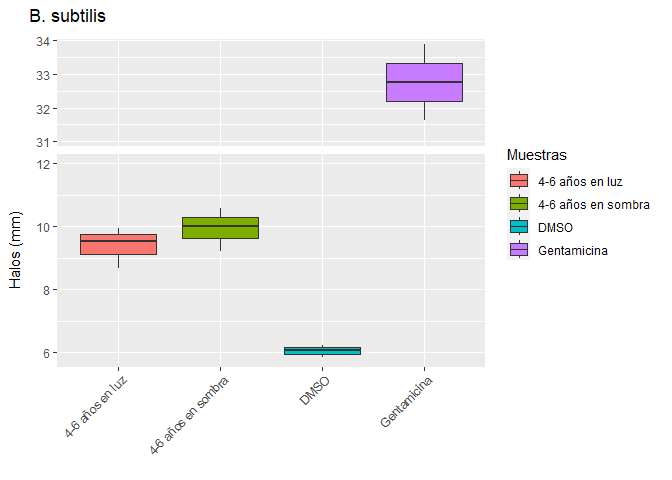
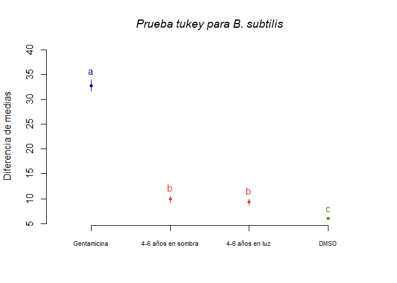
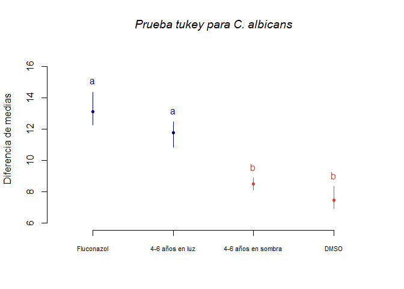

Actividad antimicrobiana de extracto etanólico de hojas de *I. guayusa*
================
Jefferson Pastuna
2023-07-30

- <a href="#objetivo-general" id="toc-objetivo-general">Objetivo
  general</a>
- <a href="#procesamiento-de-datos"
  id="toc-procesamiento-de-datos">Procesamiento de datos</a>
  - <a href="#cargado-de-datos" id="toc-cargado-de-datos">Cargado de
    datos</a>
  - <a href="#boxplot" id="toc-boxplot">Boxplot</a>
  - <a href="#homogeneidad-de-varianza"
    id="toc-homogeneidad-de-varianza">Homogeneidad de varianza</a>
  - <a href="#anova" id="toc-anova">ANOVA</a>
  - <a href="#prueba-de-tukey" id="toc-prueba-de-tukey">Prueba de tukey</a>

# Objetivo general

El presente trabajo tiene el objetivo de evaluar la actividad
antimicrobiana de extractos etanólicos de hojas de *I. guayusa* de
plantas de 4-6 años de edad ubicadas en entorno de sombra (65-190 lux) y
luz (200-425 lux).

# Procesamiento de datos

Los datos fueron obtenidos con el software
[ImageJ](https://imagej.nih.gov/ij/index.html) 1.53k v (Wayne Rasband,
National Institutes of Health, Maryland, USA) y ordenados en Excel
versión 2108.

## Cargado de datos

Las librerías R usadas se enlistan a continuación:

``` r
# Cargado de la biblioteca ggplot2
library(ggplot2)

# Instalación y cargado de la biblioteca agricolae
#install.packages("agricolae", repos = "https://cran.r-project.org")
library(agricolae)

# Instalación y cargado de la biblioteca ggbreak
#remotes::install_github("YuLab-SMU/ggbreak")
library(ggbreak)
```

Se usó la carpeta de trabajo del proyecto R como ruta preestablecida.

``` r
ppath <- "C:/Users/F4ss0/Documents/Ikiam21062022/Proyecto Guayusa/Antimicrobial_I_guayusa/"
```

Se cargó los datos almcenados en formato Excel para convertilos en
objetos R (DataFrame). Para ello se usó una variable por cada
microorganismo.

``` r
# Para B. subtilis
B_subtilis <- data.frame(readxl::read_excel("Data/Antimicrobial_H2O_EthOH_Chakra_B.xlsx", 3))

# Para S. aureus
S_aureus <- data.frame(readxl::read_excel("Data/Antimicrobial_H2O_EthOH_Chakra_B.xlsx", 5))

# Para K. pneumoniae
C_albicans <- data.frame(readxl::read_excel("Data/Antimicrobial_H2O_EthOH_Chakra_B.xlsx", 6))
```

## Boxplot

A continuación se llama los diferentes factores para ANOVA por cada
microorganismo.

``` r
# Para B. subtilis
dmso_bs <- B_subtilis[c(1:3),1]
gtm_bs  <- B_subtilis[c(1:3),2]
neg0_bs <- B_subtilis[c(1:3),3]
pos0_bs <- B_subtilis[c(1:3),4]

# Para S. aureus
dmso_sa <- S_aureus[c(1:3),1]
amp_sa  <- S_aureus[c(1:3),2]
neg0_sa <- S_aureus[c(1:3),3]
pos0_sa <- S_aureus[c(1:3),4]

# Para C. albicans
dmso_ca <- C_albicans[c(1:3),1]
gtm_ca  <- C_albicans[c(1:3),2]
neg0_ca <- C_albicans[c(1:3),3]
pos0_ca <- C_albicans[c(1:3),4]
```

Determinación del tamaño de la muestra para cada factor.

``` r
n_sample  <- length(neg0_bs)
```

Preparación de datos para el gráfico de cajas.

``` r
# Para B. subtilis
halo_bs <- c(dmso_bs,gtm_bs,neg0_bs,pos0_bs)
extract_bs <- c(rep("DMSO",n_sample),rep("Gentamicina",n_sample),rep("4-6 años en sombra",n_sample),rep("4-6 años en luz",n_sample))
datos_bs <- data.frame(extract_bs,halo_bs)

# Para S. aureus
halo_sa <- c(dmso_sa,amp_sa,neg0_sa,pos0_sa)
extract_sa <- c(rep("DMSO",n_sample),rep("Ampicilina",n_sample),rep("4-6 años en sombra",n_sample),rep("4-6 años en luz",n_sample))
datos_sa <- data.frame(extract_sa,halo_sa)

# Para C. albicams
halo_ca <- c(dmso_ca,gtm_ca,neg0_ca,pos0_ca)
extract_ca <- c(rep("DMSO",n_sample),rep("Fluconazol",n_sample),rep("4-6 años en sombra",n_sample),rep("4-6 años en luz",n_sample))
datos_ca <- data.frame(extract_ca,halo_ca)
```

Explorarión de datos mediante el gráfico de cajas.

``` r
# Para B. subtilis
bx_bs <- ggplot(datos_bs,aes(x=extract_bs,y=halo_bs,fill=extract_bs)) +
  geom_boxplot() +
  scale_y_break(c(12, 31), scales = 0.5) +
  ggtitle("B. subtilis") +
  guides(x=guide_axis(title = NULL), y=guide_axis(title = NULL), fill=guide_legend(title="Muestras")) +
  xlab(NULL) + ylab(guide_axis(title = "Halos (mm)")) +
  theme(axis.text.x=element_text(angle=45, hjust=1))

# Para S. aureus
bx_sa <- ggplot(datos_sa,aes(x=extract_sa,y=halo_sa,fill=extract_sa)) +
  geom_boxplot() +
  scale_y_break(c(7, 15), scales = 1.5) +
  ggtitle("S. aureus") +
  guides(x=guide_axis(title = NULL), y=guide_axis(title = NULL), fill=guide_legend(title="Muestras")) +
  xlab(NULL) + ylab(guide_axis(title = "Halos (mm)")) +
  theme(axis.text.x=element_text(angle=45, hjust=1))

# Para C. albicans
bx_ca <- ggplot(datos_ca,aes(x=extract_ca,y=halo_ca,fill=extract_ca)) +
  geom_boxplot() +
  #scale_y_break(c(10, 18.5), scales = 0.5) +
  ggtitle("C. albicans") +
  guides(x=guide_axis(title = NULL), y=guide_axis(title = NULL), fill=guide_legend(title="Muestras")) +
  xlab(NULL) + ylab(guide_axis(title = "Halos (mm)")) +
  theme(axis.text.x=element_text(angle=45, hjust=1))

bx_bs
```

<!-- -->

``` r
bx_sa
```

<!-- -->

``` r
bx_ca
```

<!-- -->

## Homogeneidad de varianza

Previo ANOVA es necesario verificar la homogeneidad de las variancias.
En este sentido se aprueba hipótesis nula H0 si todas las varianzas de
una población k son iguales.

``` r
# Prueba para homogenidad de varianzas para B. subtilis
bartlett.test(halo_bs~extract_bs,data = datos_bs)
```

    ## 
    ##  Bartlett test of homogeneity of variances
    ## 
    ## data:  halo_bs by extract_bs
    ## Bartlett's K-squared = 3.6904, df = 3, p-value = 0.2969

Como el p-value es 0.2969, y éste es un valor superior de 0.05,
aceptamos la hipótesis nula (H0). Esto nos indica que las muestras
presentan varianzas semejantes.

``` r
# Prueba para homogenidad de varianzas para S. aureus
bartlett.test(halo_sa~extract_sa,data = datos_sa)
```

    ## 
    ##  Bartlett test of homogeneity of variances
    ## 
    ## data:  halo_sa by extract_sa
    ## Bartlett's K-squared = 1.7659, df = 3, p-value = 0.6224

Como el p-value es 0.6224, y éste es un valor superior de 0.05,
aceptamos la hipótesis nula (H0). Esto nos indica que las muestras
presentan varianzas semejantes.

``` r
# Prueba para homogenidad de varianzas para C. albicans
bartlett.test(halo_ca~extract_ca,data = datos_ca)
```

    ## 
    ##  Bartlett test of homogeneity of variances
    ## 
    ## data:  halo_ca by extract_ca
    ## Bartlett's K-squared = 1.5187, df = 3, p-value = 0.678

Como el p-value es 0.678, y éste es un valor superior de 0.05, aceptamos
la hipótesis nula (H0). Esto nos indica que las muestras presentan
varianzas semejantes.

## ANOVA

Modelo de regresión para ANOVA para aquellos microorganismos que
mostraron homocedasticidad de varianza.

``` r
# Regresión Logit para B. subtilis (No aplica)
mylogit_bs <- glm(halo_bs~extract_bs,data = datos_bs)

# Regresión Logit para S. aureus
mylogit_sa <- glm(halo_sa~extract_sa,data = datos_sa)

# Regresión Logit para C. albicans
mylogit_ca <- glm(halo_ca~extract_ca,data = datos_ca)
```

Se procede a realizar el test de ANOVA.

``` r
# Regresión Logit para B. subtilis (No aplica)
anova(mylogit_bs,test="LRT")
```

    ## Analysis of Deviance Table
    ## 
    ## Model: gaussian, link: identity
    ## 
    ## Response: halo_bs
    ## 
    ## Terms added sequentially (first to last)
    ## 
    ## 
    ##            Df Deviance Resid. Df Resid. Dev  Pr(>Chi)    
    ## NULL                          11    1359.12              
    ## extract_bs  3   1354.7         8       4.39 < 2.2e-16 ***
    ## ---
    ## Signif. codes:  0 '***' 0.001 '**' 0.01 '*' 0.05 '.' 0.1 ' ' 1

``` r
# Regresión Logit para S. aureus
anova(mylogit_sa,test="LRT")
```

    ## Analysis of Deviance Table
    ## 
    ## Model: gaussian, link: identity
    ## 
    ## Response: halo_sa
    ## 
    ## Terms added sequentially (first to last)
    ## 
    ## 
    ##            Df Deviance Resid. Df Resid. Dev  Pr(>Chi)    
    ## NULL                          11     594.20              
    ## extract_sa  3   592.86         8       1.35 < 2.2e-16 ***
    ## ---
    ## Signif. codes:  0 '***' 0.001 '**' 0.01 '*' 0.05 '.' 0.1 ' ' 1

``` r
# Regresión Logit para C. albicans
anova(mylogit_ca,test="LRT")
```

    ## Analysis of Deviance Table
    ## 
    ## Model: gaussian, link: identity
    ## 
    ## Response: halo_ca
    ## 
    ## Terms added sequentially (first to last)
    ## 
    ## 
    ##            Df Deviance Resid. Df Resid. Dev  Pr(>Chi)    
    ## NULL                          11     68.905              
    ## extract_ca  3   63.635         8      5.270 < 2.2e-16 ***
    ## ---
    ## Signif. codes:  0 '***' 0.001 '**' 0.01 '*' 0.05 '.' 0.1 ' ' 1

## Prueba de tukey

``` r
# Para B. subtilis
modelo_bs <- aov(halo_bs~extract_bs,data = datos_bs)
tukey_bs <- HSD.test(modelo_bs,"extract_bs", group=TRUE,console=TRUE)
```

    ## 
    ## Study: modelo_bs ~ "extract_bs"
    ## 
    ## HSD Test for halo_bs 
    ## 
    ## Mean Square Error:  0.5483928 
    ## 
    ## extract_bs,  means
    ## 
    ##                      halo_bs       std r        se       Min       Max
    ## 4-6 años en luz     9.383775 0.6448951 3 0.4275483  8.674899  9.935725
    ## 4-6 años en sombra  9.940499 0.6833922 3 0.4275483  9.223984 10.585077
    ## DMSO                6.044280 0.1984948 3 0.4275483  5.833984  6.228370
    ## Gentamicina        32.751500 1.1275000 3 0.4275483 31.624000 33.879000
    ##                          Q25       Q50       Q75
    ## 4-6 años en luz     9.107801  9.540702  9.738214
    ## 4-6 años en sombra  9.618211 10.012437 10.298757
    ## DMSO                5.952236  6.070488  6.149429
    ## Gentamicina        32.187750 32.751500 33.315250
    ## 
    ## Alpha: 0.05 ; DF Error: 8 
    ## Critical Value of Studentized Range: 4.52881 
    ## 
    ## Minimun Significant Difference: 1.936285 
    ## 
    ## Treatments with the same letter are not significantly different.
    ## 
    ##                      halo_bs groups
    ## Gentamicina        32.751500      a
    ## 4-6 años en sombra  9.940499      b
    ## 4-6 años en luz     9.383775      b
    ## DMSO                6.044280      c

``` r
plot(tukey_bs, cex.names=0.7, ylab = "Diferencia de medias", main="Prueba tukey para B. subtilis", font.main=3)
```

<!-- -->

``` r
# Para S. aureus
modelo_sa <- aov(halo_sa~extract_sa,data = datos_sa)
tukey_sa <- HSD.test(modelo_sa,"extract_sa", group=TRUE,console=TRUE)
```

    ## 
    ## Study: modelo_sa ~ "extract_sa"
    ## 
    ## HSD Test for halo_sa 
    ## 
    ## Mean Square Error:  0.1682159 
    ## 
    ## extract_sa,  means
    ## 
    ##                      halo_sa       std r        se       Min       Max
    ## 4-6 años en luz    17.790446 0.4275567 3 0.2367952 17.393725 18.243295
    ## 4-6 años en sombra 17.659726 0.5260599 3 0.2367952 17.055680 18.017294
    ## Ampicilina         25.458319 0.1721943 3 0.2367952 25.270622 25.608985
    ## DMSO                5.800349 0.4285663 3 0.2367952  5.552916  6.295215
    ##                          Q25       Q50       Q75
    ## 4-6 años en luz    17.564021 17.734317 17.988806
    ## 4-6 años en sombra 17.480942 17.906204 17.961749
    ## Ampicilina         25.382985 25.495349 25.552167
    ## DMSO                5.552916  5.552916  5.924065
    ## 
    ## Alpha: 0.05 ; DF Error: 8 
    ## Critical Value of Studentized Range: 4.52881 
    ## 
    ## Minimun Significant Difference: 1.0724 
    ## 
    ## Treatments with the same letter are not significantly different.
    ## 
    ##                      halo_sa groups
    ## Ampicilina         25.458319      a
    ## 4-6 años en luz    17.790446      b
    ## 4-6 años en sombra 17.659726      b
    ## DMSO                5.800349      c

``` r
plot(tukey_sa, cex.names=0.7, ylab = "Diferencia de medias", main="Prueba tukey para S. aureus", font.main=3)
```

<!-- -->

``` r
# Para C. albicans
modelo_ca <- aov(halo_ca~extract_ca,data = datos_ca)
tukey_kp <- HSD.test(modelo_ca,"extract_ca", group=TRUE,console=TRUE)
```

    ## 
    ## Study: modelo_ca ~ "extract_ca"
    ## 
    ## HSD Test for halo_ca 
    ## 
    ## Mean Square Error:  0.6587484 
    ## 
    ## extract_ca,  means
    ## 
    ##                      halo_ca       std r        se       Min       Max
    ## 4-6 años en luz    11.766749 0.8244254 3 0.4685966 10.847683 12.441142
    ## 4-6 años en sombra  8.503861 0.3933291 3 0.4685966  8.100987  8.886894
    ## DMSO                7.463624 0.7693631 3 0.4685966  6.931516  8.345767
    ## Fluconazol         13.096966 1.0994039 3 0.4685966 12.261297 14.342407
    ##                          Q25       Q50       Q75
    ## 4-6 años en luz    11.429553 12.011424 12.226283
    ## 4-6 años en sombra  8.312344  8.523702  8.705298
    ## DMSO                7.022553  7.113589  7.729678
    ## Fluconazol         12.474246 12.687195 13.514801
    ## 
    ## Alpha: 0.05 ; DF Error: 8 
    ## Critical Value of Studentized Range: 4.52881 
    ## 
    ## Minimun Significant Difference: 2.122185 
    ## 
    ## Treatments with the same letter are not significantly different.
    ## 
    ##                      halo_ca groups
    ## Fluconazol         13.096966      a
    ## 4-6 años en luz    11.766749      a
    ## 4-6 años en sombra  8.503861      b
    ## DMSO                7.463624      b

``` r
plot(tukey_kp, cex.names=0.7, ylab = "Diferencia de medias", main="Prueba tukey para C. albicans", font.main=3)
```

<!-- -->
