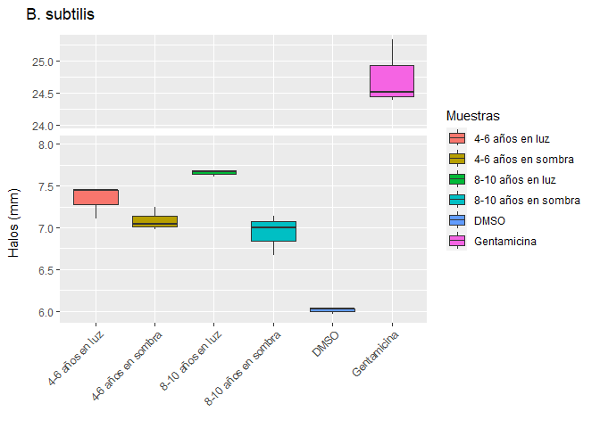
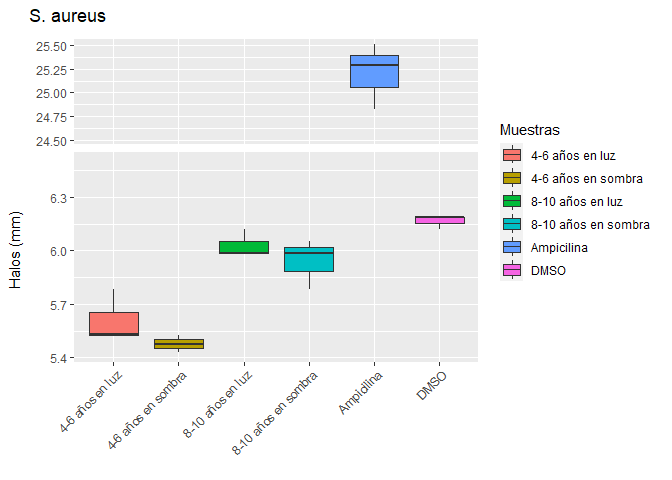
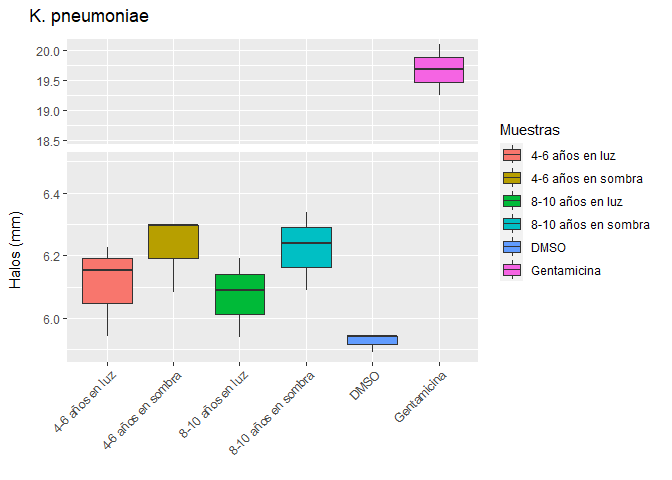
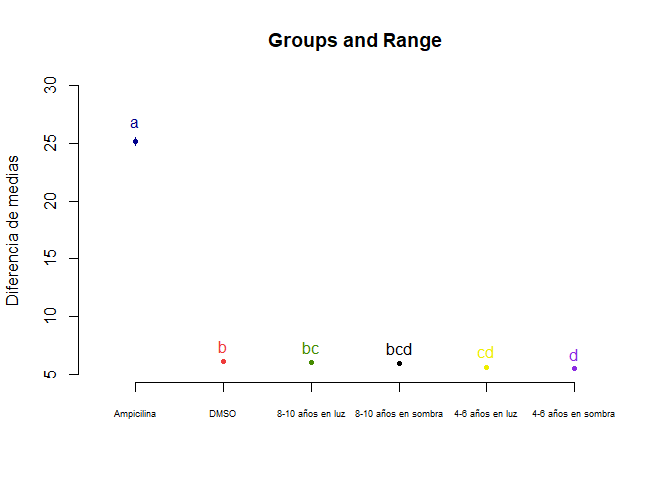
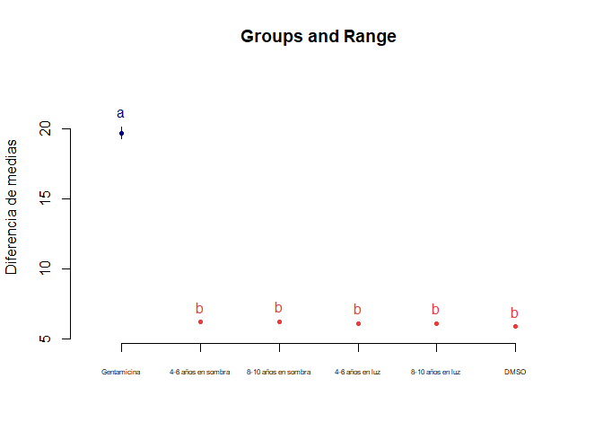

Actividad antimicrobiana de extracto acuoso de hojas de *I. guayusa*
================
Jefferson Pastuna
2023-07-09

- <a href="#objetivo-general" id="toc-objetivo-general">Objetivo
  general</a>
- <a href="#procesamiento-de-datos"
  id="toc-procesamiento-de-datos">Procesamiento de datos</a>
  - <a href="#cargado-de-datos" id="toc-cargado-de-datos">Cargado de
    datos</a>
  - <a href="#boxplot" id="toc-boxplot">Boxplot</a>
  - <a href="#homogeneidad-de-varianza"
    id="toc-homogeneidad-de-varianza">Homogeneidad de varianza</a>
  - <a href="#anova" id="toc-anova">ANOVA</a>
  - <a href="#prueba-de-tukey" id="toc-prueba-de-tukey">Prueba de tukey</a>

# Objetivo general

El presente trabajo tiene el objetivo de evaluar la actividad
antimicrobiana de extractos acuosos de hojas de *I. guayusa* a dos
edades (especímenes de 4-6 años y 8-10 años) y dos exposiciones de luz
por cada edad (entorno de 65-190 lux y 200-425 lux).

# Procesamiento de datos

Los datos fueron obtenidos con el software
[ImageJ](https://imagej.nih.gov/ij/index.html) 1.53k v (Wayne Rasband,
National Institutes of Health, Maryland, USA) y ordenados en Excel
versión 2108.

## Cargado de datos

Las librerías R usadas se enlistan a continuación:

``` r
# Cargado de la biblioteca ggplot2
library(ggplot2)

# Instalación y cargado de la biblioteca agricolae
#install.packages("agricolae", repos = "https://cran.r-project.org")
library(agricolae)

# Instalación y cargado de la biblioteca ggbreak
#remotes::install_github("YuLab-SMU/ggbreak")
library(ggbreak)
```

Se usó la carpeta de trabajo del proyecto R como ruta preestablecida.

``` r
ppath <- "C:/Users/F4ss0/Documents/Ikiam21062022/Proyecto Guayusa/Antimicrobial_I_guayusa/"
```

Se cargó los datos almcenados en formato Excel para convertilos en
objetos R (DataFrame). Para ello se usó una variable por cada
microorganismo.

``` r
# Para B. subtilis
B_subtilis <- data.frame(readxl::read_excel("Data/Antimicrobial_H2O.xlsx", 3))

# Para S. aureus
S_aureus <- data.frame(readxl::read_excel("Data/Antimicrobial_H2O.xlsx", 4))

# Para K. pneumoniae
K_pneumoniae <- data.frame(readxl::read_excel("Data/Antimicrobial_H2O.xlsx", 5))
```

## Boxplot

A continuación se llama los diferentes factores para ANOVA por cada
microorganismo.

``` r
# Para B. subtilis
dmso_bs <- B_subtilis[c(1:3),1]
gtm_bs  <- B_subtilis[c(1:3),2]
neg0_bs <- B_subtilis[c(1:3),3]
pos0_bs <- B_subtilis[c(1:3),4]
neg2_bs <- B_subtilis[c(1:3),5]
pos2_bs <- B_subtilis[c(1:3),6]

# Para S. aureus
dmso_sa <- S_aureus[c(1:3),1]
gtm_sa  <- S_aureus[c(1:3),2]
neg0_sa <- S_aureus[c(1:3),3]
pos0_sa <- S_aureus[c(1:3),4]
neg2_sa <- S_aureus[c(1:3),5]
pos2_sa <- S_aureus[c(1:3),6]

# Para K. pneumoniae
dmso_kp <- K_pneumoniae[c(1:3),1]
gtm_kp  <- K_pneumoniae[c(1:3),2]
neg0_kp <- K_pneumoniae[c(1:3),3]
pos0_kp <- K_pneumoniae[c(1:3),4]
neg2_kp <- K_pneumoniae[c(1:3),5]
pos2_kp <- K_pneumoniae[c(1:3),6]
```

Determinación del tamaño de la muestra para cada factor.

``` r
n_sample  <- length(neg0_bs)
```

Preparación de datos para el gráfico de cajas.

``` r
# Para B. subtilis
halo_bs <- c(dmso_bs,gtm_bs,neg0_bs,pos0_bs,neg2_bs,pos2_bs)
extract_bs <- c(rep("DMSO",n_sample),rep("Gentamicina",n_sample),rep("4-6 años en sombra",n_sample),rep("4-6 años en luz",n_sample),rep("8-10 años en sombra",n_sample),rep("8-10 años en luz",n_sample))
datos_bs <- data.frame(extract_bs,halo_bs)

# Para S. aureus
halo_sa <- c(dmso_sa,gtm_sa,neg0_sa,pos0_sa,neg2_sa,pos2_sa)
extract_sa <- c(rep("DMSO",n_sample),rep("Ampicilina",n_sample),rep("4-6 años en sombra",n_sample),rep("4-6 años en luz",n_sample),rep("8-10 años en sombra",n_sample),rep("8-10 años en luz",n_sample))
datos_sa <- data.frame(extract_sa,halo_sa)

# Para K. pneumoniae
halo_kp <- c(dmso_kp,gtm_kp,neg0_kp,pos0_kp,neg2_kp,pos2_kp)
extract_kp <- c(rep("DMSO",n_sample),rep("Gentamicina",n_sample),rep("4-6 años en sombra",n_sample),rep("4-6 años en luz",n_sample),rep("8-10 años en sombra",n_sample),rep("8-10 años en luz",n_sample))
datos_kp <- data.frame(extract_kp,halo_kp)
```

Explorarión de datos mediante el gráfico de cajas.

``` r
# Para B. subtilis
bx_bs <- ggplot(datos_bs,aes(x=extract_bs,y=halo_bs,fill=extract_bs)) +
  geom_boxplot() +
  scale_y_break(c(8, 24), scales = 0.5) +
  ggtitle("B. subtilis") +
  guides(x=guide_axis(title = NULL), y=guide_axis(title = NULL), fill=guide_legend(title="Muestras")) +
  xlab(NULL) + ylab(guide_axis(title = "Halos (mm)")) +
  theme(axis.text.x=element_text(angle=45, hjust=1))

# Para S. aureus
bx_sa <- ggplot(datos_sa,aes(x=extract_sa,y=halo_sa,fill=extract_sa)) +
  geom_boxplot() +
  scale_y_break(c(6.5, 24.5), scales = 0.5) +
  ggtitle("S. aureus") +
  guides(x=guide_axis(title = NULL), y=guide_axis(title = NULL), fill=guide_legend(title="Muestras")) +
  xlab(NULL) + ylab(guide_axis(title = "Halos (mm)")) +
  theme(axis.text.x=element_text(angle=45, hjust=1))

# Para K. pneumoniae
bx_kp <- ggplot(datos_kp,aes(x=extract_kp,y=halo_kp,fill=extract_kp)) +
  geom_boxplot() +
  scale_y_break(c(6.5, 18.5), scales = 0.5) +
  ggtitle("K. pneumoniae") +
  guides(x=guide_axis(title = NULL), y=guide_axis(title = NULL), fill=guide_legend(title="Muestras")) +
  xlab(NULL) + ylab(guide_axis(title = "Halos (mm)")) +
  theme(axis.text.x=element_text(angle=45, hjust=1))

bx_bs
```

<!-- -->

``` r
bx_sa
```

<!-- -->

``` r
bx_kp
```

<!-- -->

## Homogeneidad de varianza

Previo ANOVA es necesario verificar la homogeneidad de las variancias.
En este sentido se aprueba hipótesis nula H0 si todas las varianzas de
una población k son iguales.

``` r
# Prueba para homogenidad de varianzas para B. subtilis
bartlett.test(halo_bs~extract_bs,data = datos_bs)
```

    ## 
    ##  Bartlett test of homogeneity of variances
    ## 
    ## data:  halo_bs by extract_bs
    ## Bartlett's K-squared = 12.854, df = 5, p-value = 0.02479

Como el p-value es 0.02479, y éste es un valor menor de 0.05, rechazamos
la hipótesis nula (H0). Esto nos indica que las muestras presentan
varianzas diferentes.

``` r
# Prueba para homogenidad de varianzas para S. aureus
bartlett.test(halo_sa~extract_sa,data = datos_sa)
```

    ## 
    ##  Bartlett test of homogeneity of variances
    ## 
    ## data:  halo_sa by extract_sa
    ## Bartlett's K-squared = 10.481, df = 5, p-value = 0.06269

Como el p-value es 0.06269, y éste es un valor superior de 0.05,
aceptamos la hipótesis nula (H0). Esto nos indica que las muestras
presentan varianzas semejantes.

``` r
# Prueba para homogenidad de varianzas para K. pneumoniae
bartlett.test(halo_kp~extract_kp,data = datos_kp)
```

    ## 
    ##  Bartlett test of homogeneity of variances
    ## 
    ## data:  halo_kp by extract_kp
    ## Bartlett's K-squared = 9.9321, df = 5, p-value = 0.07718

Como el p-value es 0.07718, y éste es un valor superior de 0.05,
aceptamos la hipótesis nula (H0). Esto nos indica que las muestras
presentan varianzas semejantes.

## ANOVA

Modelo de regresión para ANOVA para aquellos microorganismos que
mostraron homocedasticidad de varianza.

``` r
# Regresión Logit para B. subtilis (No aplica)
#mylogit_bs <- glm(halo_bs~extract_bs,data = datos_bs)

# Regresión Logit para S. aureus
mylogit_sa <- glm(halo_sa~extract_sa,data = datos_sa)

# Regresión Logit para K. pneumoniae
mylogit_kp <- glm(halo_kp~extract_kp,data = datos_kp)
```

Se procede a realizar el test de ANOVA.

``` r
# Regresión Logit para B. subtilis (No aplica)
#anova(mylogit_bs,test="LRT")

# Regresión Logit para S. aureus
anova(mylogit_sa,test="LRT")
```

    ## Analysis of Deviance Table
    ## 
    ## Model: gaussian, link: identity
    ## 
    ## Response: halo_sa
    ## 
    ## Terms added sequentially (first to last)
    ## 
    ## 
    ##            Df Deviance Resid. Df Resid. Dev  Pr(>Chi)    
    ## NULL                          17     938.44              
    ## extract_sa  5   938.09        12       0.35 < 2.2e-16 ***
    ## ---
    ## Signif. codes:  0 '***' 0.001 '**' 0.01 '*' 0.05 '.' 0.1 ' ' 1

``` r
# Regresión Logit para K. pneumoniae
anova(mylogit_kp,test="LRT")
```

    ## Analysis of Deviance Table
    ## 
    ## Model: gaussian, link: identity
    ## 
    ## Response: halo_kp
    ## 
    ## Terms added sequentially (first to last)
    ## 
    ## 
    ##            Df Deviance Resid. Df Resid. Dev  Pr(>Chi)    
    ## NULL                          17     460.47              
    ## extract_kp  5   459.97        12       0.50 < 2.2e-16 ***
    ## ---
    ## Signif. codes:  0 '***' 0.001 '**' 0.01 '*' 0.05 '.' 0.1 ' ' 1

## Prueba de tukey

``` r
# Para B. subtilis (No aplica)
#modelo_bs <- aov(halo_bs~extract_bs,data = datos_bs)
#tukey_bs <- HSD.test(modelo,"extract_bs", group=TRUE,console=TRUE,
                  #main="B. subtilis")
#plot(tukey_bs)

# Para S. aureus
modelo_sa <- aov(halo_sa~extract_sa,data = datos_sa)
tukey_sa <- HSD.test(modelo_sa,"extract_sa", group=TRUE,console=TRUE, main="S. aureus")
```

    ## 
    ## Study: S. aureus
    ## 
    ## HSD Test for halo_sa 
    ## 
    ## Mean Square Error:  0.02917667 
    ## 
    ## extract_sa,  means
    ## 
    ##                       halo_sa        std r         se       Min       Max
    ## 4-6 años en luz      5.612334 0.14619483 3 0.09861824  5.527451  5.781144
    ## 4-6 años en sombra   5.477264 0.05013389 3 0.09861824  5.427184  5.527451
    ## 8-10 años en luz     6.031336 0.07773737 3 0.09861824  5.986454  6.121099
    ## 8-10 años en sombra  5.941997 0.13988853 3 0.09861824  5.785282  6.054254
    ## Ampicilina          25.206323 0.35222898 3 0.09861824 24.819577 25.508718
    ## DMSO                 6.165769 0.03868524 3 0.09861824  6.121099  6.188262
    ##                           Q25       Q50       Q75
    ## 4-6 años en luz      5.527929  5.528406  5.654775
    ## 4-6 años en sombra   5.452171  5.477158  5.502305
    ## 8-10 años en luz     5.986454  5.986454  6.053777
    ## 8-10 años en sombra  5.885868  5.986454  6.020354
    ## Ampicilina          25.055126 25.290675 25.399697
    ## DMSO                 6.154522  6.187944  6.188103
    ## 
    ## Alpha: 0.05 ; DF Error: 12 
    ## Critical Value of Studentized Range: 4.750231 
    ## 
    ## Minimun Significant Difference: 0.4684595 
    ## 
    ## Treatments with the same letter are not significantly different.
    ## 
    ##                       halo_sa groups
    ## Ampicilina          25.206323      a
    ## DMSO                 6.165769      b
    ## 8-10 años en luz     6.031336     bc
    ## 8-10 años en sombra  5.941997    bcd
    ## 4-6 años en luz      5.612334     cd
    ## 4-6 años en sombra   5.477264      d

``` r
plot(tukey_sa, cex.names=0.55, ylab = "Diferencia de medias")
```

<!-- -->

``` r
# Para K. pneumoniae
modelo_kp <- aov(halo_kp~extract_kp,data = datos_kp)
tukey_kp <- HSD.test(modelo_kp,"extract_kp", group=TRUE,console=TRUE, main="K. pneumoniae")
```

    ## 
    ## Study: K. pneumoniae
    ## 
    ## HSD Test for halo_kp 
    ## 
    ## Mean Square Error:  0.0415587 
    ## 
    ## extract_kp,  means
    ## 
    ##                       halo_kp        std r        se       Min       Max
    ## 4-6 años en luz      6.107730 0.14717728 3 0.1176983  5.942846  6.225823
    ## 4-6 años en sombra   6.225399 0.12202746 3 0.1176983  6.084493  6.295851
    ## 8-10 años en luz     6.073247 0.12633748 3 0.1176983  5.939662  6.190809
    ## 8-10 años en sombra  6.222852 0.12589361 3 0.1176983  6.089586  6.339778
    ## DMSO                 5.925232 0.03050687 3 0.1176983  5.890006  5.942846
    ## Gentamicina         19.672400 0.42433398 3 0.1176983 19.245334 20.093948
    ##                           Q25       Q50       Q75
    ## 4-6 años en luz      6.048684  6.154522  6.190172
    ## 4-6 años en sombra   6.190172  6.295851  6.295851
    ## 8-10 años en luz     6.014465  6.089268  6.140039
    ## 8-10 años en sombra  6.164389  6.239192  6.289485
    ## DMSO                 5.916426  5.942846  5.942846
    ## Gentamicina         19.461626 19.677917 19.885933
    ## 
    ## Alpha: 0.05 ; DF Error: 12 
    ## Critical Value of Studentized Range: 4.750231 
    ## 
    ## Minimun Significant Difference: 0.5590944 
    ## 
    ## Treatments with the same letter are not significantly different.
    ## 
    ##                       halo_kp groups
    ## Gentamicina         19.672400      a
    ## 4-6 años en sombra   6.225399      b
    ## 8-10 años en sombra  6.222852      b
    ## 4-6 años en luz      6.107730      b
    ## 8-10 años en luz     6.073247      b
    ## DMSO                 5.925232      b

``` r
plot(tukey_kp, cex.names=0.5, ylab = "Diferencia de medias")
```

<!-- -->
