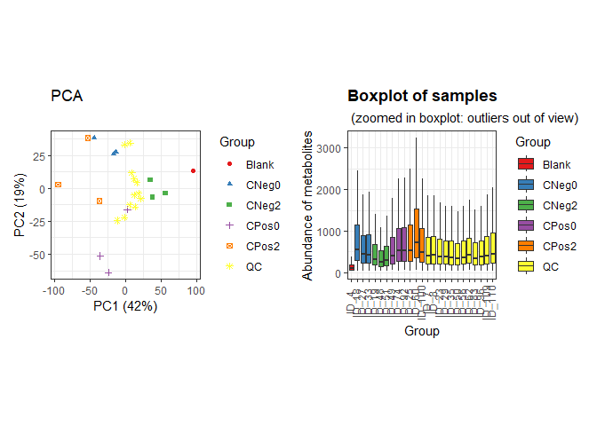
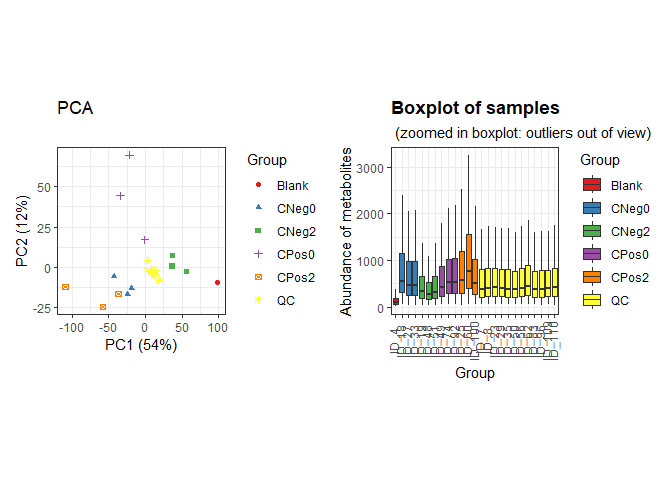
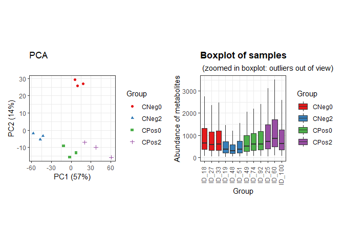
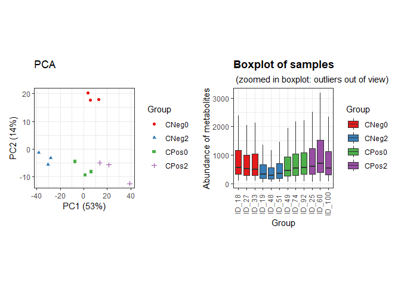
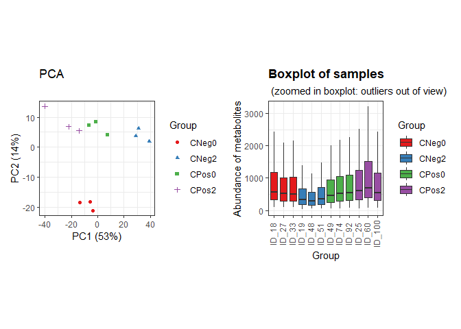
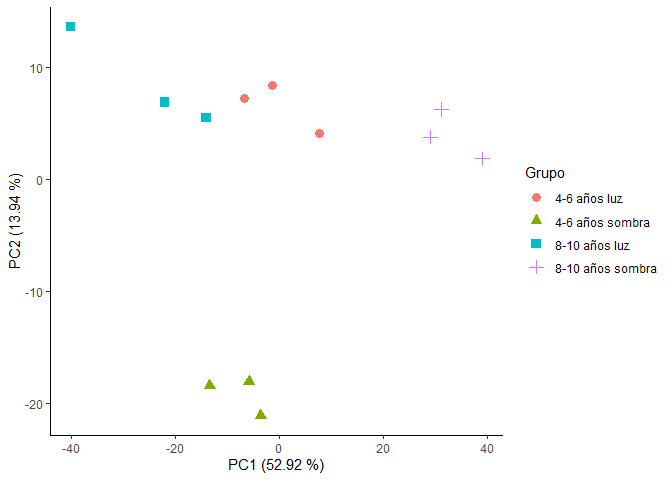
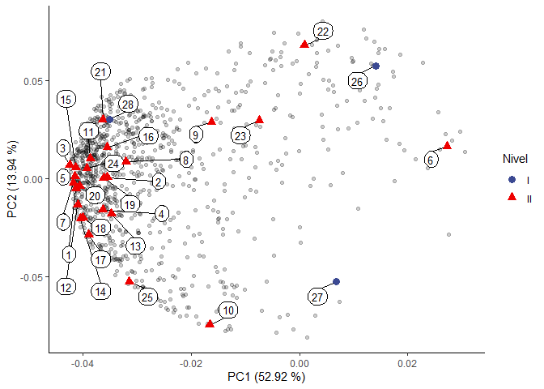
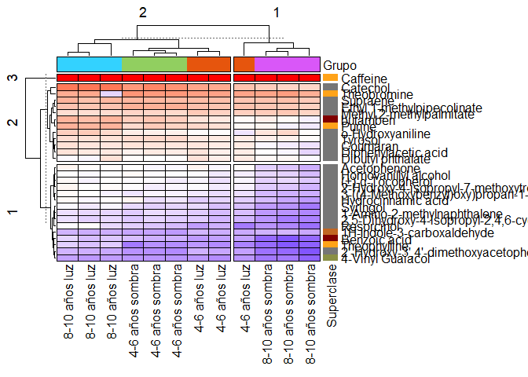
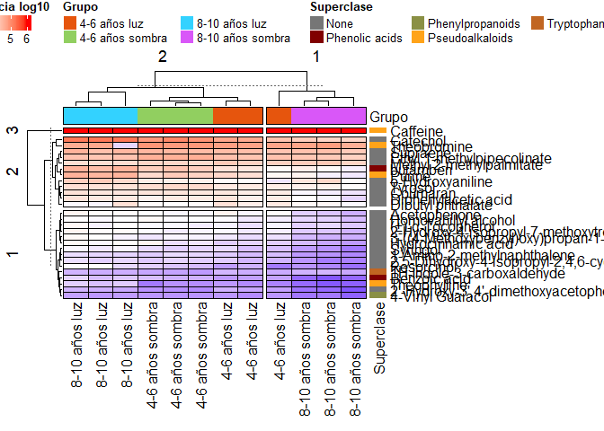

Análisis estadístico de los datos obtenidos en la caracterización de los
metabolitos en extracto acuoso de las hojas de *Ilex guayusa*
================
Jefferson Pastuña
2023-09-15

- <a href="#introducción" id="toc-introducción">Introducción</a>
- <a href="#antes-de-empezar" id="toc-antes-de-empezar">Antes de
  empezar</a>
- <a href="#flujo-de-trabajo-notame"
  id="toc-flujo-de-trabajo-notame">Flujo de trabajo Notame</a>
- <a href="#preprocesamiento"
  id="toc-preprocesamiento">Preprocesamiento</a>
- <a href="#análisis-de-componentes-principales"
  id="toc-análisis-de-componentes-principales">Análisis de Componentes
  Principales</a>
- <a href="#mapa-de-calor" id="toc-mapa-de-calor">Mapa de calor</a>

## Introducción

El objetivo de este Script R fue registrar el análisis estadístico de
extractos acuosos de *Ilex guayusa*. En cada paso se detalla una
descripción de lo que hacen los código usados.

El flujo de trabajo usado fue tomado de [“notame”: Workflow for
Non-Targeted LC–MS Metabolic
Profiling](https://doi.org/10.3390/metabo10040135). El cual ofece una
gran variedad de herrmientas para el pretratamiento de datos previo el
análisis estadístico.

## Antes de empezar

El paquete “notame” acepta lista de picos cromatográficos provenientes
de softwares como MZMine, MSDial, entre otros. En este caso la lista de
picos cromatográficos fue obtenido mediante MZmine. El archivo (\*.csv)
fue acondicionado para que pueda ser leído por el paquete “notame”.

## Flujo de trabajo Notame

El primer paso fue la instalación del paquete “notame” y sus paquetes
dependientes.

``` r
# Notame package installation
#if (!requireNamespace("devtools", quietly = TRUE)) {
#  install.packages("devtools")
#}
#devtools::install_github("antonvsdata/notame")

# Notame library call
library(notame)

# Dependency packages installation
install_dependencies
```

    ## function (preprocessing = TRUE, extra = FALSE, batch_corr = FALSE, 
    ##     misc = FALSE, ...) 
    ## {
    ##     core_cran <- c("BiocManager", "cowplot", "missForest", "openxlsx", 
    ##         "randomForest", "RColorBrewer", "Rtsne")
    ##     core_bioconductor <- "pcaMethods"
    ##     extra_cran <- c("car", "doParallel", "devEMF", "ggbeeswarm", 
    ##         "ggdendro", "ggrepel", "Hmisc", "hexbin", "igraph", "lme4", 
    ##         "lmerTest", "MuMIn", "PERMANOVA", "PK", "rmcorr")
    ##     extra_bioconductor <- c("mixOmics", "supraHex")
    ##     extra_gitlab <- "CarlBrunius/MUVR"
    ##     batch_cran <- "fpc"
    ##     batch_bioconductor <- "RUVSeq"
    ##     batch_github <- NULL
    ##     batch_gitlab <- "CarlBrunius/batchCorr"
    ##     misc_cran <- c("knitr", "rmarkdown", "testthat")
    ##     if (preprocessing) {
    ##         install_helper(cran = core_cran, bioconductor = core_bioconductor, 
    ##             ...)
    ##     }
    ##     if (extra) {
    ##         install_helper(cran = extra_cran, bioconductor = extra_bioconductor, 
    ##             gitlab = extra_gitlab, ...)
    ##     }
    ##     if (batch_corr) {
    ##         install_helper(cran = batch_cran, bioconductor = batch_bioconductor, 
    ##             github = batch_github, gitlab = batch_gitlab, ...)
    ##     }
    ##     if (misc) {
    ##         install_helper(cran = misc_cran, ...)
    ##     }
    ## }
    ## <bytecode: 0x000002fc110a0c58>
    ## <environment: namespace:notame>

Luego, se creó una ruta general de trabajo y un archivo (\*.txt) para
registrar el historial de las funciones “notame” usadas.

``` r
# Main path
ppath <- "C:/Users/F4ss0/Documents/Ikiam21062022/Proyecto Guayusa/Antimicrobial_I_guayusa/"
# Log system
init_log(log_file = paste0(ppath, "Result/GCMS/GCMS_log.txt"))
```

    ## INFO [2023-09-17 14:09:58] Starting logging

Lo siguiente fue cargar el libro Excel (\*.xlsx) con la lista de picos
obtenida en MZmine.

``` r
data <- read_from_excel(file = "Data/Guayusa_H2O_GCMS_QC_and_Samples_to_R.xlsx", sheet = 1, 
                        corner_row = 5, corner_column = "G", 
                        split_by = c("Column", "Ion Mode"))
```

    ## INFO [2023-09-17 14:10:05] Corner detected correctly at row 5, column G
    ## INFO [2023-09-17 14:10:05] 
    ## Extracting sample information from rows 1 to 5 and columns H to AF
    ## INFO [2023-09-17 14:10:05] Replacing spaces in sample information column names with underscores (_)
    ## INFO [2023-09-17 14:10:05] Naming the last column of sample information "Datafile"
    ## INFO [2023-09-17 14:10:05] 
    ## Extracting feature information from rows 6 to 3718 and columns A to G
    ## INFO [2023-09-17 14:10:05] Creating Split column from Column, Ion Mode
    ## INFO [2023-09-17 14:10:06] Feature_ID column not found, creating feature IDs
    ## INFO [2023-09-17 14:10:06] Identified m/z column mass and retention time column RT
    ## INFO [2023-09-17 14:10:06] Creating feature IDs from Split, m/z and retention time
    ## INFO [2023-09-17 14:10:06] Replacing dots (.) in feature information column names with underscores (_)
    ## INFO [2023-09-17 14:10:06] 
    ## Extracting feature abundances from rows 6 to 3718 and columns H to AF
    ## INFO [2023-09-17 14:10:06] 
    ## Checking sample information
    ## INFO [2023-09-17 14:10:06] QC column generated from rows containing 'QC'
    ## INFO [2023-09-17 14:10:06] Sample ID autogenerated from injection orders and prefix ID_
    ## INFO [2023-09-17 14:10:06] Checking that feature abundances only contain numeric values
    ## INFO [2023-09-17 14:10:07] 
    ## Checking feature information
    ## INFO [2023-09-17 14:10:07] Checking that feature IDs are unique and not stored as numbers
    ## INFO [2023-09-17 14:10:07] Checking that m/z and retention time values are reasonable

Una vez leído los datos, el siguiente paso fue agrupar la información
mediante la función construct_metabosets de “notame”.

``` r
modes <- construct_metabosets(exprs = data$exprs, 
                              pheno_data = data$pheno_data, 
                              feature_data = data$feature_data,
                              group_col = "Group")
```

    ## Initializing the object(s) with unflagged features
    ## INFO [2023-09-17 14:10:07] 
    ## Checking feature information
    ## INFO [2023-09-17 14:10:07] Checking that feature IDs are unique and not stored as numbers
    ## INFO [2023-09-17 14:10:07] Checking that feature abundances only contain numeric values
    ## INFO [2023-09-17 14:10:07] Setting row and column names of exprs based on feature and pheno data

Podemos visualizar los datos mediante un PCA y gráfico de cajas antes de
proceder con el pretratamiento de “notame”.

``` r
# Data extraction
mode_test <- modes$Rxt5_EI
# Boxplot of raw data
raw_bp <- plot_sample_boxplots(mode_test,
                               order_by = "Group",
                               fill_by = "Group")
# PCA of raw data
raw_pca <- plot_pca(mode_test,
                       center = TRUE,
                       shape = "Group",
                       color = "Group")
# Package to plots visualization in same windows
#if (!requireNamespace("devtools", quietly = TRUE)) {
#  install.packages("devtools")
#}
#devtools::install_github("thomasp85/patchwork")
library(patchwork)
# Plot
raw_pca + raw_bp
```

<!-- -->

## Preprocesamiento

El primer paso del preprocesamiento fue reemplazar valores cero por NA.

``` r
# Data extraction
mode <- modes$Rxt5_EI
# Change 0 value to NA
mode <- mark_nas(mode, value = 0)
```

Luego, los picos cromatográficos con una tasa de detección baja serán
marcadas y luego se puede decidir en eliminarlos. El paquete “notame”
emplea dos criterios para seleccionar estos picos cromatográficos.
Primero, es la presencia de picos cromatográficos en las inyecciones del
control de calidad y segundo, la presencia de picos cromatográficos en
las inyecciones réplicas de los grupos/clases de las muestras.

``` r
# Low detection rate
mode <- flag_detection(mode, qc_limit = 0.70, group_limit = 0.80)
```

    ## INFO [2023-09-17 14:10:20] 
    ## 4% of features flagged for low detection rate

``` r
# Some statistics after low detection algorithm
visualizations(mode, prefix = paste0(ppath, "Figure/GCMS/", "Low_Detection"))
```

Con estos valores, aquellos picos cromatográficos que no se detectaron
en el 70 % de las inyecciones del control de calidad y el 80 % de los
grupos de muestra se marcarán con la etiqueta “low_detection”.

El siguiente paso para el preprocesamiento corresponde a la corrección
del efecto Drift (pérdida de intensidad de los picos propio del
espectrómetro de masas). El efecto Drift se corrigió mediante regresión
cúbica.

``` r
# Drift correction
corrected <- correct_drift(mode)
```

    ## INFO [2023-09-17 14:24:41] 
    ## Starting drift correction at 2023-09-17 14:24:41
    ## INFO [2023-09-17 14:25:35] Drift correction performed at 2023-09-17 14:25:35
    ## INFO [2023-09-17 14:25:59] Inspecting drift correction results 2023-09-17 14:25:59
    ## INFO [2023-09-17 14:26:44] Drift correction results inspected at 2023-09-17 14:26:44
    ## INFO [2023-09-17 14:26:44] 
    ## Drift correction results inspected, report:
    ## Drift_corrected: 99%,  Missing_QCS: 1%

``` r
# Flag low quality features
corrected <- flag_quality(corrected, condition = "RSD_r < 0.3 & D_ratio_r < 0.6")
```

    ## INFO [2023-09-17 14:26:45] 
    ## 10% of features flagged for low quality

Podemos visualizar los datos tras la corrección del efecto Drift.

``` r
# Boxplot
corr_bp <- plot_sample_boxplots(corrected,
                                      order_by = "Group",
                                      fill_by = "Group")
# PCA
corr_pca <- plot_pca(corrected,
                        center = TRUE,
                        shape = "Group",
                        color = "Group") 
# Plot
corr_pca + corr_bp
```

<!-- -->

A continuación, los contaminantes de acuerdo con el blanco de
procesamiento serán removidos. Una vez eliminado los picos
cromatográficos contaminantes, el blanco será excluido en los análisis
posteriores.

``` r
# Removal of contaminants
corrected_no_blank <- flag_contaminants(corrected,
                                        blank_col = "Group",
                                        blank_label = "Blank",
                                        flag_thresh = 0.30,
                                        flag_label = "Contaminant")
```

    ## INFO [2023-09-17 14:26:54] 
    ## 25% of features flagged as contaminants

``` r
# Removal blank group from dataset
corrected_no_blank <- corrected_no_blank[, corrected_no_blank$Group != "Blank"]
```

``` r
# Some statistics after low detection algorithm
visualizations(corrected_no_blank, prefix = paste0(ppath, "Figure/GCMS/", "No_Blank"))
```

El siguiente paso remueve los QC, ya que, no será necesario en análisis
posteriores.

``` r
corrected_no_qc <- drop_qcs(corrected_no_blank)
```

A continuación, se visualizan los datos sin los QC.

``` r
# Boxplot
no_qc_bp <- plot_sample_boxplots(corrected_no_qc,
                                 order_by = "Group",
                                 fill_by = "Group")
# PCA
no_qc_pca <- plot_pca(corrected_no_qc,
                      center = TRUE,
                      shape = "Group",
                      color = "Group")
# Plot
no_qc_pca + no_qc_bp
```

<!-- -->

El siguiente paso crea clústeres. Este paso reduce el número de picos
cromatográficos ya que, correlaciona posibles fragmentos de una misma
molécula debido a la ionización EI (Impacto de Electrones) de 70 eV.

``` r
clustered <- cluster_features(corrected_no_qc,
                              rt_window = 1/360,
                              all_features = TRUE,
                              corr_thresh = 0.95,
                              d_thresh = 0.8,
                              #plotting = TRUE,
                              #prefix = paste0(ppath, "Cluster/GCMS/GCMS_Cluster")
                              )
compressed <- compress_clusters(clustered)
```

Podemos visualizar los datos tras la búsqueda de clústeres.

``` r
# Boxplot
compr_bp <- plot_sample_boxplots(compressed,
                                 order_by = "Group",
                                 fill_by = "Group")
# PCA
compr_pca <- plot_pca(compressed,
                      center = TRUE,
                      shape = "Group",
                      color = "Group")
# Plot
compr_pca + compr_bp
```

<!-- -->

En el siguiente paso imputará valores faltantes en el set de datos.

``` r
# To clean data
set.seed(21)
imputed <- impute_rf(compressed)
```

    ## INFO [2023-09-17 15:14:32] 
    ## Starting random forest imputation at 2023-09-17 15:14:32
    ## INFO [2023-09-17 15:14:45] Out-of-bag error in random forest imputation: 0.136
    ## INFO [2023-09-17 15:14:45] Random forest imputation finished at 2023-09-17 15:14:45

Podemos observar los datos tras la imputación.

``` r
# Boxplot
imp_bp <- plot_sample_boxplots(imputed,
                               order_by = "Group",
                               fill_by = "Group")
# PCA
imp_pca <- plot_pca(imputed,
                    center = TRUE,
                    shape = "Group",
                    color = "Group")
# Plot
imp_pca + imp_bp
```

<!-- -->

Finalmente, los datos están listos para ser explotados y usados en
análisis posteriores.

``` r
save(imputed, file = paste0(ppath, "Result/GCMS/Notame_GCMS_output.RData"))
```

# Análisis de Componentes Principales

En este paso eliminamos aquellos picos que se hayan etiquetado durante
los controles de calidad mediante el paquete de R “notame”.

``` r
# Extract clean data
no_flag <- drop_flagged(imputed)
# Extracting feature height table
peak_height <- exprs(no_flag)
# Extracting Phenotipic data
pheno_data <- no_flag@phenoData@data
```

Preparación de datos.

``` r
# Transposing feature height table
transp_table  <- t(peak_height)
# Changing NA to 0 
transp_table[is.na(transp_table)]=0
# Centering and Scaling features
ei_pca <- prcomp(transp_table, center = TRUE, scale. = TRUE)
```

Gráfico del plano principal del PCA.

``` r
# Library to left_join use
library(dplyr)
# PCA scores
scores <- ei_pca$x %>%                   # Get PC coordinates
  data.frame %>%                         # Convert to data frames
  mutate(Sample_ID = rownames(.)) %>%    # Create a new column with the sample names
  left_join(pheno_data )                 # Adding metadata
# PCA plot
ggplot(scores,
       aes(PC1, PC2, shape = Grupo, color = Grupo)) +
  geom_point(size = 3) +
  guides(x=guide_axis(title = "PC1 (52.92 %)"),
         y=guide_axis(title = "PC2 (13.94 %)")) +
  #geom_text(label=pheno_data$Group, nudge_x = 1, nudge_y = 1, show.legend = FALSE)+
  theme_classic()
```

<!-- -->

``` r
# Save plot
ggsave('Result/GCMS/GCMS_PCA.png', width = 6, height = 3, device='png', dpi="print")
```

Gráfico del círculo de correlaciones del PCA.

``` r
loadings <- ei_pca$rotation %>%           # Extract loadings
  data.frame(Feature_ID = rownames(.))  # New column with feat name
```

A continuación, se añade los metabolitos identificados en el círculo de
correlaciones del PCA. En azul metabolitos con nivel de identificación 1
y en rojo metabolitos con nivel de identificación 2.

``` r
# Load a metabolite name table
metab_name <- readxl::read_excel("Data/GCMS_Metabolites.xlsx", 5)
# Creating a new small table of the annotated compounds
ei_compouds <- left_join(metab_name, loadings)
# Plotting results
ggplot(loadings, aes(PC1, PC2)) + 
  geom_point(alpha = 0.2) +
  theme_classic() + 
  geom_point(data = ei_compouds, size = 1) +
  ggrepel::geom_label_repel(data = ei_compouds,
                            aes(label = Metabolite_Code),
                            max.overlaps = 40,
                            box.padding = 0.5,
                            label.padding = 0.25,
                            label.r = 0.5,
                            cex = 3.5) +
  geom_point(data = ei_compouds,
             aes(shape = Nivel, color = Nivel),
             size = 3) +
  guides(x=guide_axis(title = "PC1 (52.92 %)"),
         y=guide_axis(title = "PC2 (13.94 %)")) +
  ggsci::scale_color_aaas()
```

<!-- -->

``` r
# Save plot
ggsave('Result/GCMS/GCMS_Loadings.png', width = 11, height = 9, device='png', dpi= 300)
```

# Mapa de calor

Instalación del paquete ComplexHeatmap y otros paquetes dependentes.

``` r
# ComplexHeatmap package installation
#if (!requireNamespace("BiocManager", quietly=TRUE))
#    install.packages("BiocManager")
#BiocManager::install("ComplexHeatmap")
library(ComplexHeatmap)

# ColorRamp2 package installation
#if (!requireNamespace("devtools", quietly = TRUE)) {
#  install.packages("devtools")
#}
#devtools::install_github("jokergoo/colorRamp2")
library("colorRamp2")

# Cowplot package installation
#install.packages("cowplot")
library(cowplot)
```

Extracción y cargado de la abundancia de los metabolitos identificados.

``` r
# Metabolite name table
metab_name_hm <- readxl::read_excel("Data/GCMS_Metabolites.xlsx", 5)
# Add identified metabolite to "notame" output
add_met <- join_fData(no_flag, metab_name_hm)
# Extracting identified metabolite data
raw_hm <- add_met[!is.na(add_met@featureData@data$Metabolite_name),]
# Extracting feature height table
hm_height <- exprs(raw_hm)
# Extracting sample information
hm_pdata <- raw_hm@phenoData@data
# Extracting feature information
hm_fdata <- raw_hm@featureData@data
```

Escalado de datos y anotaciones (superior y laterales) para el gráfico
del mapa de calor.

``` r
set.seed(810)
# Logarithmic scale
hm_scl <- log10(hm_height)
rownames(hm_scl) <- hm_fdata$Metabolite_name
colnames(hm_scl) <- hm_pdata$Grupo
# Metabolite class color
cols_metclass <- c("None" = "#767676FF",
                   "Phenolic acids" = "#800000FF",
                   "Phenylpropanoids" = "#8A9045FF",
                   "Pseudoalkaloids" = "#FFA319FF",
                   "Tryptophan alkaloids" = "#C16622FF")
# Add row anotation to HeatMap
hm_row_ann <- rowAnnotation(`Superclase` = hm_fdata$Superclass,
                            col = list(`Superclase` = cols_metclass),
                            show_annotation_name = T,
                            show_legend=F)
# Species color
cols_species <- c("4-6 años luz" = "#e6550d",
                 "4-6 años sombra" = "#91cf60",
                 "8-10 años luz" = "#33d2ff",
                 "8-10 años sombra" = "#d957f8")
# Add top anotation to HeatMap
top_info_ann <- HeatmapAnnotation(`Grupo` = hm_pdata$Grupo,
                                  col = list(`Grupo` = cols_species),
                                  show_annotation_name = T,
                                  show_legend=F, 
                                  border = TRUE)
# Color scale
mycol <- colorRamp2(c(2, 3.5, 6),
                    c("blue", "white", "red"))
# Heatmap matrix plotting
hm_plot <- Heatmap(hm_scl,
        col = mycol,
        border_gp = grid::gpar(col = "black", lty = 0.05),
        rect_gp = grid::gpar(col = "black", lwd = 0.75),
        clustering_distance_columns = "euclidean",
        clustering_method_columns = "complete",
        top_annotation = top_info_ann,
        right_annotation = hm_row_ann,
        show_heatmap_legend = F,
        row_km = 3, column_km = 2)
hm_plot
```

<!-- -->

Agregar leyendas al mapa de calor.

``` r
# Color scale legend
lgd1 <- Legend(col_fun = mycol,
               title = "Abundancia log10",
               at = seq(6),
               direction = "horizontal" )
# Group legend
lgd2 <- Legend(labels = c("4-6 años luz",
                          "4-6 años sombra",
                          "8-10 años luz",
                          "8-10 años sombra"),
               legend_gp = gpar(fill = cols_species),
               title = "Grupo", ncol = 2)
# Metabolite class Legend
lgd3 <- Legend(labels = c(unique(hm_fdata$Superclass)) ,
               legend_gp = gpar(fill = cols_metclass), 
               title = "Superclase", ncol = 3)
```

Gráfico del mapa de calor.

``` r
set.seed(810)
# Converting to ggplot
gg_heatmap <- grid.grabExpr(draw(hm_plot))
gg_heatmap <- ggpubr::as_ggplot(gg_heatmap)
# Legends
all_legends <- packLegend(lgd1, lgd2, lgd3, direction = "horizontal")
gg_legend <- grid.grabExpr(draw(all_legends))
gg_legend_fn <- ggpubr::as_ggplot(gg_legend)
# Heatmap plot
gcms_hm <- plot_grid(gg_legend_fn,
          gg_heatmap, ncol = 1,
          rel_heights = c(0.10, 0.88))
gcms_hm
```

<!-- -->

``` r
# Save heatmap plot
ggsave(filename = "Result/GCMS/GCMS_Heatmap.jpeg", plot = gcms_hm,
      width = 5.5, height = 4.7, units = "in", dpi = 300, scale = 1.7)
```

Historial de las funciones “notame” usadas.

``` r
finish_log()
```

    ## INFO [2023-09-17 15:15:51] Finished analysis. Sun Sep 17 15:15:51 2023
    ## Session info:
    ## 
    ## INFO [2023-09-17 15:15:51] R version 4.2.2 (2022-10-31 ucrt)
    ## INFO [2023-09-17 15:15:51] Platform: x86_64-w64-mingw32/x64 (64-bit)
    ## INFO [2023-09-17 15:15:51] Running under: Windows 10 x64 (build 19045)
    ## INFO [2023-09-17 15:15:51] 
    ## INFO [2023-09-17 15:15:51] Matrix products: default
    ## INFO [2023-09-17 15:15:51] 
    ## INFO [2023-09-17 15:15:51] locale:
    ## INFO [2023-09-17 15:15:51] [1] LC_COLLATE=Spanish_Spain.utf8  LC_CTYPE=Spanish_Spain.utf8   
    ## INFO [2023-09-17 15:15:51] [3] LC_MONETARY=Spanish_Spain.utf8 LC_NUMERIC=C                  
    ## INFO [2023-09-17 15:15:51] [5] LC_TIME=Spanish_Spain.utf8    
    ## INFO [2023-09-17 15:15:51] 
    ## INFO [2023-09-17 15:15:51] attached base packages:
    ## INFO [2023-09-17 15:15:51] [1] grid      stats     graphics  grDevices utils     datasets  methods  
    ## INFO [2023-09-17 15:15:51] [8] base     
    ## INFO [2023-09-17 15:15:51] 
    ## INFO [2023-09-17 15:15:51] other attached packages:
    ## INFO [2023-09-17 15:15:51]  [1] cowplot_1.1.2         colorRamp2_0.0.1      ComplexHeatmap_2.14.0
    ## INFO [2023-09-17 15:15:51]  [4] dplyr_1.1.0           patchwork_1.1.2.9000  notame_0.2.0         
    ## INFO [2023-09-17 15:15:51]  [7] magrittr_2.0.3        ggplot2_3.4.1.9000    futile.logger_1.4.3  
    ## INFO [2023-09-17 15:15:51] [10] Biobase_2.58.0        BiocGenerics_0.44.0  
    ## INFO [2023-09-17 15:15:51] 
    ## INFO [2023-09-17 15:15:51] loaded via a namespace (and not attached):
    ## INFO [2023-09-17 15:15:51]  [1] matrixStats_0.63.0   fs_1.6.1             usethis_2.1.6       
    ## INFO [2023-09-17 15:15:51]  [4] doParallel_1.0.14    RColorBrewer_1.1-3   ggsci_3.0.0         
    ## INFO [2023-09-17 15:15:51]  [7] backports_1.4.1      tools_4.2.2          doRNG_1.8.6         
    ## INFO [2023-09-17 15:15:51] [10] utf8_1.2.3           R6_2.5.1             colorspace_2.1-0    
    ## INFO [2023-09-17 15:15:51] [13] GetoptLong_1.0.5     withr_2.5.0          tidyselect_1.2.0    
    ## INFO [2023-09-17 15:15:51] [16] compiler_4.2.2       textshaping_0.3.6    cli_3.6.0           
    ## INFO [2023-09-17 15:15:51] [19] formatR_1.14         ggdendro_0.1.23      labeling_0.4.2      
    ## INFO [2023-09-17 15:15:51] [22] scales_1.2.1         randomForest_4.7-1.1 askpass_1.1         
    ## INFO [2023-09-17 15:15:51] [25] systemfonts_1.0.4    digest_0.6.31        rmarkdown_2.20      
    ## INFO [2023-09-17 15:15:51] [28] pkgconfig_2.0.3      htmltools_0.5.4      fastmap_1.1.0       
    ## INFO [2023-09-17 15:15:51] [31] itertools_0.1-3      highr_0.10           rlang_1.0.6         
    ## INFO [2023-09-17 15:15:51] [34] GlobalOptions_0.1.2  readxl_1.4.2.9000    rstudioapi_0.14     
    ## INFO [2023-09-17 15:15:51] [37] shape_1.4.6          farver_2.1.1         generics_0.1.3      
    ## INFO [2023-09-17 15:15:51] [40] car_3.1-2            zip_2.2.2            credentials_1.3.2   
    ## INFO [2023-09-17 15:15:51] [43] Rcpp_1.0.10          munsell_0.5.0        S4Vectors_0.36.2    
    ## INFO [2023-09-17 15:15:51] [46] fansi_1.0.4          abind_1.4-5          lifecycle_1.0.3     
    ## INFO [2023-09-17 15:15:51] [49] stringi_1.7.12       yaml_2.3.7           carData_3.0-5       
    ## INFO [2023-09-17 15:15:51] [52] MASS_7.3-58.1        Rtsne_0.17           parallel_4.2.2      
    ## INFO [2023-09-17 15:15:51] [55] ggrepel_0.9.2.9999   crayon_1.5.2         circlize_0.4.15     
    ## INFO [2023-09-17 15:15:51] [58] sys_3.4.1            knitr_1.42           pillar_1.8.1        
    ## INFO [2023-09-17 15:15:51] [61] igraph_1.4.1.9002    ggpubr_0.6.0         rjson_0.2.21        
    ## INFO [2023-09-17 15:15:51] [64] ggsignif_0.6.4       rngtools_1.5.2       codetools_0.2-18    
    ## INFO [2023-09-17 15:15:51] [67] stats4_4.2.2         futile.options_1.0.1 glue_1.6.2          
    ## INFO [2023-09-17 15:15:51] [70] evaluate_0.20        pcaMethods_1.90.0    lambda.r_1.2.4      
    ## INFO [2023-09-17 15:15:51] [73] png_0.1-8            vctrs_0.5.2          missForest_1.5      
    ## INFO [2023-09-17 15:15:51] [76] foreach_1.5.2        cellranger_1.1.0     gtable_0.3.1        
    ## INFO [2023-09-17 15:15:51] [79] openssl_2.0.5        purrr_1.0.1          tidyr_1.3.0         
    ## INFO [2023-09-17 15:15:51] [82] clue_0.3-64          xfun_0.37            openxlsx_4.2.5.2    
    ## INFO [2023-09-17 15:15:51] [85] broom_1.0.4          rstatix_0.7.2        ragg_1.2.5          
    ## INFO [2023-09-17 15:15:51] [88] viridisLite_0.4.1    gert_1.9.2           tibble_3.1.8        
    ## INFO [2023-09-17 15:15:51] [91] iterators_1.0.14     IRanges_2.32.0       cluster_2.1.4
